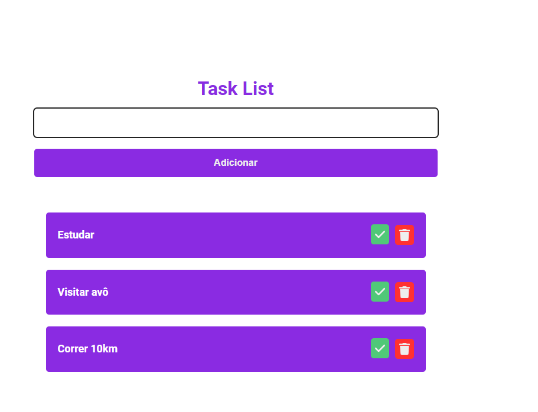
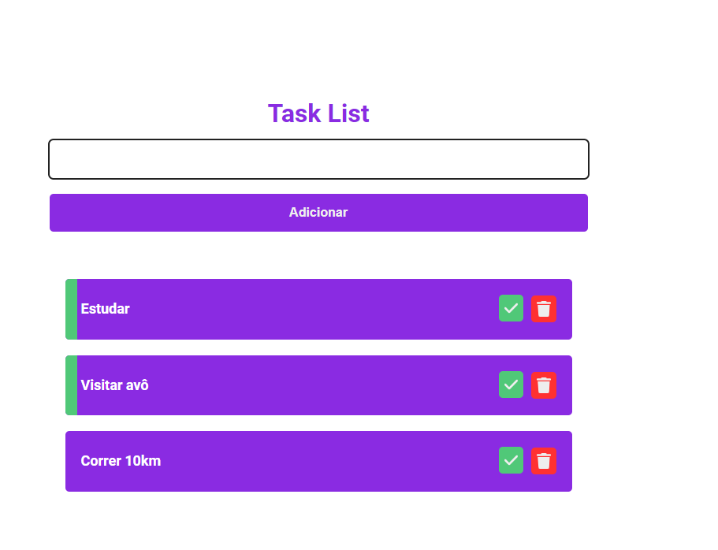

# TaskList-React

  
  

  <h2>Tecnologias usadas</h2>
  
  <ul>
    <li>React js</li>
    <li>Vite</li>
  </ul>

  <h2>Descrição</h2>
  
  

    Este é um projeto simples, feito com o objetivo de de estudar a base do React.
  

